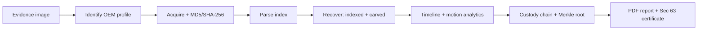

# Saakshi
 
**A vendor-agnostic forensic platform for DVR/NVR surveillance evidence.**
 
*Saakshi* (साक्षी) means "witness". Smart India Hackathon 2026 · Problem Statement **SIH26150** · National Technical Research Organisation (NTRO) · Theme: Blockchain & Cybersecurity · Team **Fsociety**
 
> **Please read:** every result in this repository is produced from a **synthetic DVR disk image** generated by `scripts/make_synthetic_dvr.py`. It simulates a fictional vendor format ("VendorX"). Nothing here has been validated on real OEM devices yet, and none of the numbers should be quoted as real-device performance. See [Status](#status) for exactly what works.
 
---
 
## The problem
 
DVR/NVR footage is key evidence, but every OEM (Hikvision, Dahua, CP Plus, Uniview, TP-Link, Honeywell, Godrej, Matrix and others) uses its own storage layout, index structure, metadata and video container. Investigators end up using several vendor tools, which leads to inconsistent results, unreliable timestamps, lost deleted footage and a weak chain of custody.
 
## What Saakshi does
 
One workflow, from evidence image to court-ready report:
 
1. **Identify** the device by matching the image against OEM profiles.
2. **Acquire** the image read-only and compute MD5 + SHA-256 in a single pass.
3. **Parse** the profile's index structure into a common evidence model.
4. **Recover** footage, including segments whose index entries were deleted, by carving H.264 NAL units. Every recovered clip is exported to a playable `.mp4` and hashed.
5. **Build a timeline** across cameras with the DVR clock offset estimated.
6. **Analyse** recovered video for motion events.
7. **Seal custody** with an append-only hash chain and a Merkle root over the evidence.
8. **Report** as a PDF containing hashes, recovered clips, motion events, the custody trail and a Section 63 certificate (Bharatiya Sakshya Adhiniyam, 2023).

 
## Status
 
Honest summary, verified by running `scripts/run_demo.py`:
 
| Stage | State | Notes |
|---|---|---|
| Identification | Working | Matches the image header against profiles in `profiles/` (synthetic VendorX only) |
| Acquisition | Working | One-pass MD5 + SHA-256 |
| Index parsing | Working | Parses the synthetic VendorX index table |
| Recovery | Working, basic | Extracts indexed segments and carves unindexed H.264 data from the synthetic image. A more complete carver and GOP repair exist in `saakshi/backend/app/modules/recovery/` but are not yet wired into the demo pipeline |
| Timeline | **Placeholder** | Clock offset is currently a fixed value for the synthetic image, not computed from the video. Real estimation (stream timestamps, OCR) is planned |
| Motion analytics | Working, basic | OpenCV frame differencing |
| Custody | Working, basic | Hash-chained log and Merkle root in SQLite. Verification currently checks the linkage between entries |
| Report | Working, basic | ReportLab PDF with hashes, clip table, motion events and the Section 63 certificate page |
| Dashboard | Working | Streamlit app (`ui/app.py`) |
| OEM profiles | **Skeletons** | Files for the eight target OEMs exist as placeholders. No real vendor format has been implemented |
| Network/E01 acquisition, face/object detection, OCR, blind format discovery, Hyperledger Fabric anchoring | **Planned** | Stubs only |
 
The folder `saakshi/` additionally holds a larger scaffold (FastAPI backend, React frontend, unit-tested carver, GOP repair, Merkle tree and custody chain, docs and SOP templates). See `saakshi/STATUS.md` for the module-by-module state.
 
## Quick start
 
Requires Python 3.10+ (developed on 3.12). FFmpeg is bundled through `imageio-ffmpeg`, so no system install is needed.
 
```bash
git clone https://github.com/Failureguy94/Saakshi.git
cd Saakshi
 
python -m venv .venv
source .venv/bin/activate          # Windows: .venv\Scripts\activate
pip install -r requirements.txt
 
# 1. Generate the synthetic DVR image and run the whole pipeline
python scripts/run_demo.py
 
# 2. Open the dashboard
streamlit run ui/app.py
```
 
`run_demo.py` creates everything under `out/`: the disk image, recovered clips, `saakshi.db`, `ground_truth.json` and `report.pdf`. Running it again resets the database and regenerates the image.
 
Using `make`: `make init`, `make demo`, `make ui`, `make clean`.
 
### Dashboard tabs
**Evidence** · **Recovery** (segment table and disk map) · **Timeline** (motion events) · **Integrity** (custody log, Merkle root, verify, tamper demo) · **Report** (generate and download the PDF).
 
## Repository layout
 
```
Saakshi/
├─ scripts/            synthetic DVR generator, pipeline runner (run_demo.py)
├─ ui/app.py           Streamlit dashboard
├─ profiles/           OEM profile files (VendorX + placeholder skeletons)
├─ out/                generated outputs (image, clips, database, report)
└─ saakshi/
   ├─ modules/         demo pipeline: identification, acquisition, parsing,
   │                   recovery, timeline, analytics, custody, reporting
   ├─ backend/         FastAPI scaffold with the unit-tested engine pieces
   │                   (NAL carver, GOP repair, Merkle tree, custody chain)
   ├─ frontend/        React + TypeScript + Tailwind scaffold
   ├─ docs/            architecture, evidence model, SOP templates, validation plan
   └─ STATUS.md        module-by-module status
```
 
## Known limitations
 
- Works only on the synthetic VendorX format. Real OEM formats need lab verification on actual devices, which has not been done.
- The timeline offset is a placeholder, not yet estimated from the footage.
- Custody verification does not yet re-derive every entry's hash from its content.
- The React frontend is not connected to the demo pipeline yet.
- There is no handling of encrypted drives.
## Roadmap
 
1. Wire the full carver and GOP repair into the pipeline.
2. Compute the clock offset per camera from stream timing, then add OCR of the on-screen clock.
3. Recompute entry hashes on custody verification and add Merkle inclusion proofs per clip.
4. Connect the React frontend to the pipeline through an API.
5. Implement the first real OEM profile from a lab-acquired image, then add more.
6. Hyperledger Fabric anchoring for the custody ledger.
## Team
 
**Fsociety**, Smart India Hackathon 2026 (Team ID 155347), Indian Institute of Information Technology, Nagpur.
 
## License
 
See [`saakshi/LICENSE`](saakshi/LICENSE).
