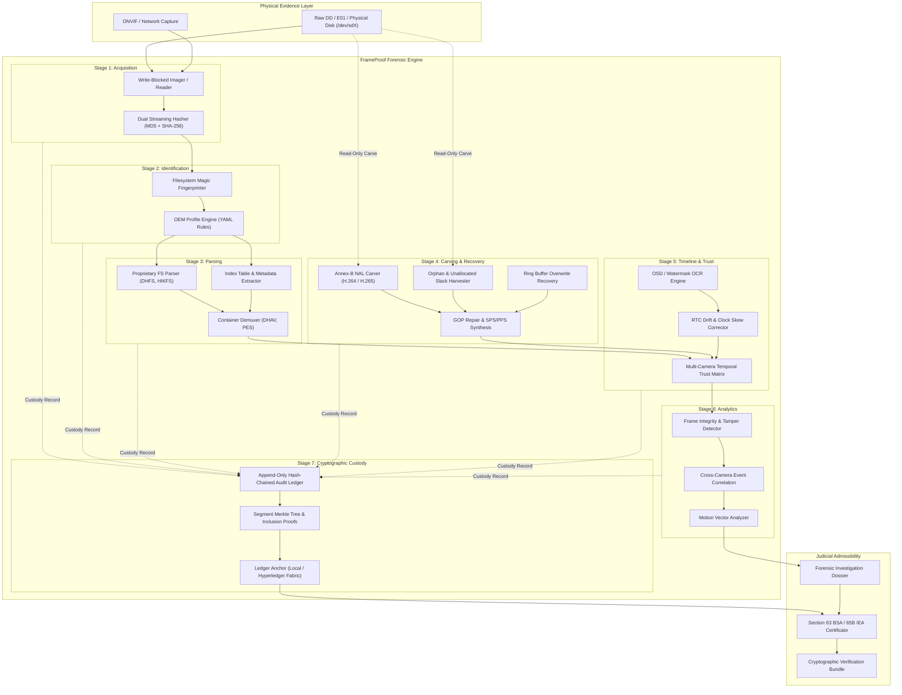

# FrameProof (SIH 2026 • PS SIH26150 • NTRO)

**Vendor-Agnostic DVR/NVR Digital Forensic Analysis Platform**

FrameProof standardizes proprietary, corrupt, or unindexed surveillance disk footage into court-admissible digital evidence under **Section 63 of the Bharatiya Sakshya Adhiniyam, 2023 (BSA)** and **Section 65B of the Indian Evidence Act (IEA)**. It guarantees strict read-only evidence handling, cryptographic chain-of-custody tracking, and offline air-gapped operation.

---

## 1. System Architecture



---

## 2. Implemented vs Planned (Honesty Matrix)

Detailed module-by-module breakdown is tracked in [`STATUS.md`](STATUS.md).

### Implemented Foundation Pieces (Production-Grade with Passing Tests)
1. **`acquisition/hashing.py`**:
   - Single-pass, chunked streaming dual hasher computing MD5 and SHA-256 simultaneously without duplicating reads.
   - Strict read-only file handle enforcement (`ReadOnlySecurityGuard`).
2. **`custody/merkle.py`**:
   - RFC 6962-compliant Merkle tree engine with cryptographic domain separation (`0x00` leaf, `0x01` internal node).
   - Generates compact cryptographic inclusion audit paths and verifies proofs against expected roots.
3. **`custody/chain.py` + `anchor/local_ledger.py`**:
   - Append-only hash-chained custody log binding index, timestamp, actor, action, evidence hash, and previous block hash.
   - Genesis block anchored with 64 zero-hex hash; `verify_chain()` detects single-bit tampering, altered actions, and broken links.
   - `LocalLedgerAnchor` persists receipts locally; `FabricAnchor` declared as an abstract pluggable stub.
   - Shared `@forensic_stage` decorator enforcing read-only paths and automatic custody logging.
4. **`profiles/schema.py` + `loader.py`**:
   - Strict Pydantic v2 schemas defining OEM volume layout, partition table, indexing, container types, and timestamp clocks.
   - Validated YAML profiles for 9 OEMs: **Hikvision**, **Dahua**, **CP Plus**, **Uniview**, **TP-Link**, **Honeywell**, **Godrej**, **Matrix**, and **Generic**. All marked `status: placeholder` with explicit `todo_fields` to preserve scientific integrity.
5. **`recovery/nal_carver.py` & `scripts/make_synthetic_image.py`**:
   - High-throughput Annex-B start code scanner (3-byte `00 00 01` and 4-byte `00 00 00 01`).
   - Bit-level NAL classification for H.264 (SPS, PPS, IDR, non-IDR, SEI, AUD) and H.265 (VPS, SPS, PPS, IDR).
   - Tested and verified against deterministic synthetic disk images generated by `scripts/make_synthetic_image.py`.
6. **FastAPI Backend & Database**:
   - Full REST API with `/health` returning air-gap status and `/cases` CRUD backed by SQLAlchemy 2.0 and Alembic migrations.
   - Clean typed routers for all forensic pipeline endpoints.
7. **Frontend (React + TypeScript + Vite + TailwindCSS)**:
   - Full monorepo frontend with React Router across 7 pages: Dashboard (live `/health` querying), Cases, Evidence Tree, Disk Map, Multi-Camera Timeline, Custody Ledger, and Sec 63 Reports.
8. **Independent Verification CLI**:
   - `scripts/verify_ledger.py`: Zero-dependency standalone script for defense counsel, magistrates, or lab auditors to verify custody logs.

### Stubs & Planned Extensions
- Direct hardware block-level imager (`acquisition/imager.py`) and E01 decompressor (`readers/e01.py`).
- Proprietary filesystem parsers (`parsing/filesystem.py`) and index decoders (`parsing/index_parser.py`).
- Circular FIFO ring buffer boundary detection (`recovery/ring_buffer.py`) and GOP repair (`recovery/gop_repair.py`).
- Rust accelerated Annex-B carver (to drop behind `BaseNALCarver` interface).
- OCR engine for video on-screen timestamps (`timeline/osd_ocr.py`) and clock drift estimation (`timeline/drift.py`).
- Video tamper detection (`analytics/tamper.py`) and cross-camera event graphs (`analytics/event_graph.py`).
- Hyperledger Fabric consortium anchoring backend (`anchor/fabric.py`).

---

## 3. Quickstart Guide

### Prerequisites
- Docker & Docker Compose **OR** Python 3.12+ with `uv` and Node.js 20+

### Option A: Complete Docker Setup
```bash
# Start all services (backend, worker, postgres, redis, frontend)
make up

# Backend API: http://localhost:8000 (Swagger docs at http://localhost:8000/docs)
# Frontend UI: http://localhost:3000
```

### Option B: Local Development & Tests
```bash
# 1. Run backend tests (unit & integration)
make test

# 2. Run static analysis and linters
make lint

# 3. Format codebase
make format

# 4. Build frontend bundle
make build-frontend
```

---

## 4. Running Tests Manually

```bash
cd backend
# Using uv (recommended)
uv run pytest -v tests/
uv run ruff check app tests
uv run mypy app
```

### Verifying a Custody Log
```bash
python scripts/verify_ledger.py /path/to/custody_chain.jsonl
```

### Generating Synthetic Test Disk Images
```bash
python scripts/make_synthetic_image.py --output /tmp/test_synthetic.raw --size 32768
```
