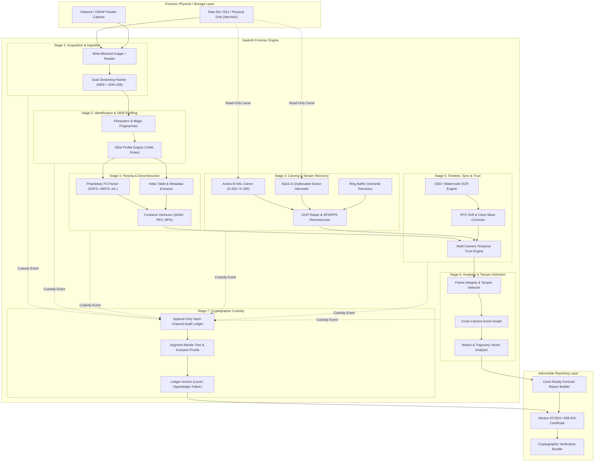
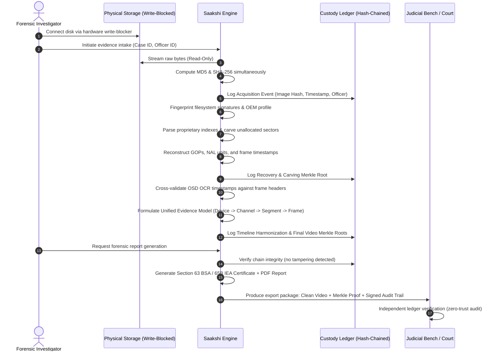

# Saakshi Architecture & Forensic Data Flow

Saakshi is an air-gapped, vendor-agnostic DVR/NVR digital forensics platform designed for Smart India Hackathon 2026 (PS SIH26150, NTRO). It standardizes proprietary, corrupt, or raw surveillance disk images into court-admissible forensic evidence complying with Section 63 of Bharatiya Sakshya Adhiniyam, 2023 (BSA) / Section 65B of Indian Evidence Act (IEA).

---

## 1. High-Level Modular Architecture

---

## 2. End-to-End Forensic Data Flow: Disk to Court

---

## 3. Guarantees & Constraints
1. **Strict Read-Only Access**: All intake modules enforce OS read-only open flags (`O_RDONLY`).
2. **Deterministic Cryptographic Chain**: Every evidence modification or analysis produces an immutable audit record in the custody chain.
3. **Air-Gapped Operation**: Zero outbound dependencies, telemetry, or external API calls.
